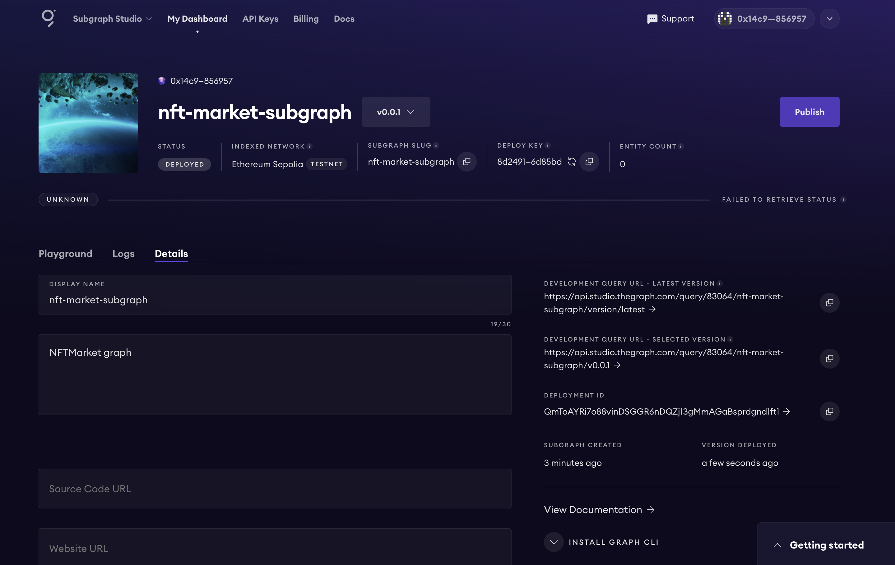
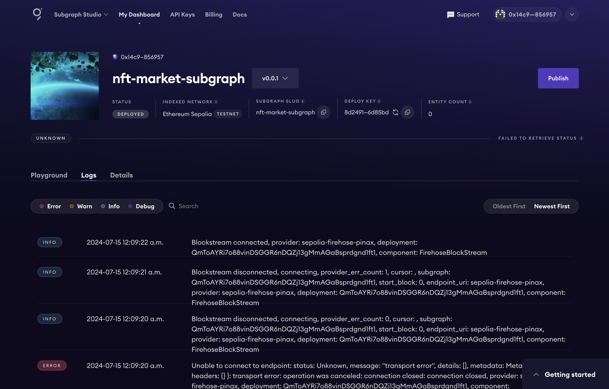
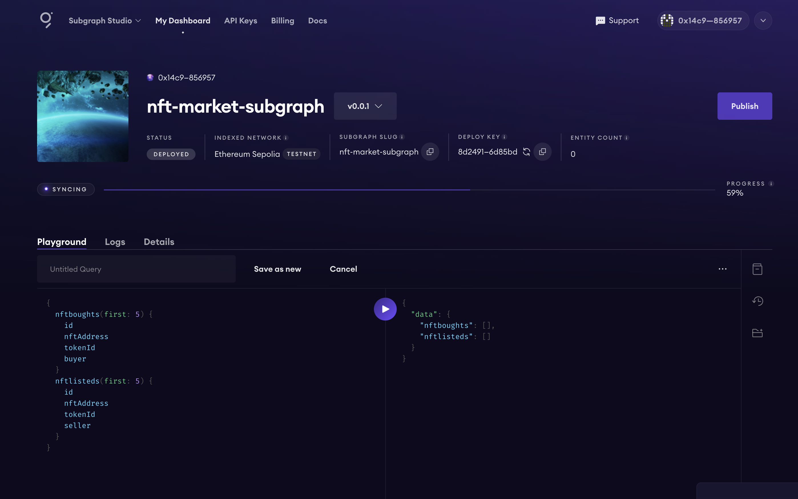

# 为NFTMarket创建一个The Graph子图
## 学习资料
- 快速入门： https://thegraph.com/docs/zh/quick-start/
- 如何编写一个子图的详细介绍 https://thegraph.com/docs/zh/developing/creating-a-subgraph/
- 如何查询一个子图的详细介绍 https://thegraph.com/docs/zh/querying/querying-from-an-application/
- 中文相关资源列表： https://www.notion.so/graphprotocolcn/The-Graph-49977afa44644ebf9052b9220f539396
- The graph bounty中一个比较好的子图的例子： https://github.com/Autosaida/Zircuit-Restaking-Subgraph/
- The graph bounty中一个比较好的Usage of Subgraph的例子：https://github.com/ttttonyhe/stader-graph-dashboard
## 任务要求及步骤
1. 安装Graph CLI
在本地环境中安装Graph CLI工具
2. 初始化子图
使用Graph CLI初始化一个新的子图
3. 配置子图（subgraph.yaml）
设置要索引的NFTMarket合约和List、Buy事件
4. 定义Schema（schema.graphql）
定义List和Buy实体
5. 编写映射（mapping.ts）
编写映射逻辑，以处理合约事件并更新子图的存储
6. 部署子图
使用Graph CLI工具部署子图到The Graph Studio。
## 提交要求
- 提交NFTMarket合约地址
- 提交在The Graph Sudio ( https://thegraph.com/studio/ ) 上部署的子图的链接以及截图

NFTMarket合约地址: sepolia.etherscan.io/address/0x610a95b0f300e69Df7ad987AE333E74B2BA42758
在The Graph Sudio ( thegraph.com/studio ) 上部署的子图的链接: api.studio.thegraph.com/query/82579/openbuild-nftmarket/v0.0.1
部署、查询、Log等截图：

- 
- 
- 